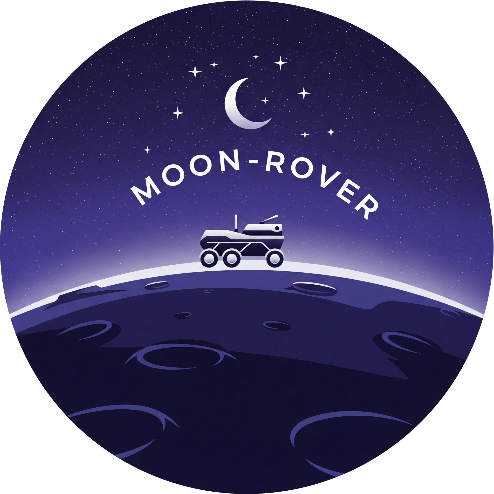

# Moon-Rover 🌙

Moon-Rover is a meticulously crafted Discord bot, designed exclusively for enhancing the experience of personal Discord communities. Developed with precicion in Java and powered by the robust JDA framework, Moon-Rover seamlessly integrates advanced features like role assignment, dynamic custom commands, and efficient data retrieval mechanisms.



## Features 🚀

- **Enhanced Role Assignment**: Automate and streamline user roles with ease.
- **Dynamic Custom Commands**: Tailored commands to cater to unique community needs.
- **Efficient Data Retrieval**: Fetch and display data seamlessly, enhancing user interactions.

> **Note:** The Stack Overflow Integration Plugin is currently **under development**.

## Stack Overflow Integration Plugin 🧠

This plugin for MoonBot provides seamless integration with the Stack Exchange API. It will allow Discord users to search for Stack Overflow questions and answers directly from a Discord channel, retrieving relevant information with a simple command.

#### Plugin Features

* **Search Functionality**: Users can search for specific questions using keywords.
* **Answer Retrieval**: The plugin will display key information from relevant questions and a snippet of the accepted answer.
* **In-Discord Access**: All functionality is available directly within the Discord environment.

## Getting Started for Developers 🌌

1.  **Prerequisites**:
    * **Java Development Kit (JDK)**: Moon-Rover requires **JDK 21** or later. You can download it from the official Oracle or OpenJDK website.
    * **Apache Maven**: The project is built using Maven. You can download the latest version from the Apache Maven website.
    * **Git**: You will need Git installed to clone the repository.
2.  **Installation**:
    * **Clone the repository**: `git clone https://github.com/Lunova-Engineering/Moon-Bot.git`
    * **Navigate to the project directory**: `cd Moon-Bot`
3.  **Configuration**:
    * **Maven Setup**: Ensure that both **JDK** and **Maven** are correctly added to your system's **PATH** environment variable. You can verify this by running `java -version` and `mvn -v` in your terminal.
    * **Discord Bot Token**: You must have a Discord bot token to run the bot. Create a `server_configuration.properties` file in `core/data` and add your token: `discord.bot.token=YOUR_BOT_TOKEN_HERE`.
    * **Stack Exchange API Key**: To use the Stack Overflow plugin, you must obtain a Stack Exchange API key and set it as an environment variable. The variable must be named **`STACKAPPS_API_KEY`**.
4.  **Running**:
    * **Build the project**: `mvn clean install`
    * **Run the application**: `java -jar core/target/moon-bot-core-0.2.0-SNAPSHOT.jar`

## Usage 🛠

```bash
# Placeholder for usage commands
# Example:
# java -jar moon-rover.jar <arguments>

## Implementation 💡

```java
// Placeholder for code snippets or implementation details
// Example:
// MoonRoverBot bot = new MoonRoverBot(TOKEN);
// bot.start();
```
## Contributing 🤝

We welcome contributions from the developer community! If you'd like to contribute, please fork the repository and make
changes as you'd like. Pull requests are warmly welcome.

## License 📜

This project is licensed under the MIT License - see
the [LICENSE.md](https://github.com/Lunova-Engineering/Moon-Rover/blob/main/LICENSE) file for details.

## Acknowledgments 🌟

- Thanks to [JDA](https://github.com/DV8FromTheWorld/JDA) for their fantastic Discord API wrapper.
- [Other acknowledgments or libraries/tools used]
